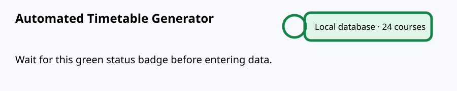
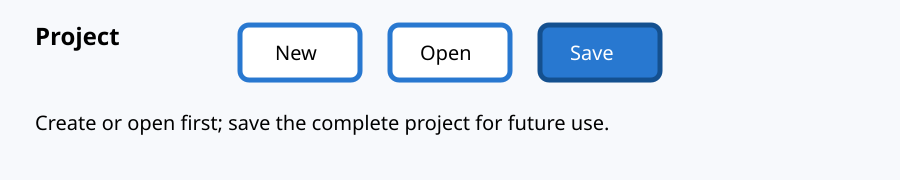
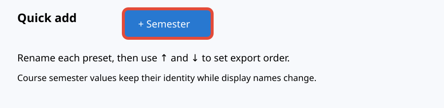

# University timetable: picture guide

This guide is also available offline from **Help** inside the application. The annotated illustrations in `docs/tutorial-images/` show the controls to click.

## 1. Wait for the connection
Start the app and wait for the top-right badge to change from **Connecting…** to **Local database** or **Server database** with course and room counts. If it says Database offline, fix the database before entering data.

## 2. Create or open a project
Click **New** for a blank project, or **Open** to select an existing `.ttproj` file. Give a new project a meaningful name. A project contains the catalogue, settings, timetable, and saved assignments. Click **Save as** once to choose a folder, then press **Save** regularly.

## 3. Set up the university document
Click **Document**. Enter institution, program, term, commencement, and any printed semester text. This only changes export headings. Do this before adding catalogue data; you do not need to set up semesters here.

## 4. Add buildings
Click **+ Building** near the top-right, enter a building name, and save. You can rename or delete buildings under **Manage data → Buildings**.

## 5. Add and order semesters
Click **+ Semester**. The manager starts with Semester 1 through Semester 8. Edit a name (for example `First Year — Fall`), then click **↑** or **↓** to move it. Changes are saved as project settings and the order is reflected by the semester picker and semester export grouping. **Manage data → Semesters** opens the same editor.

## 6. Add rooms
Click **+ Room**, select a relevant building, enter the room number and capacity, and choose **Classroom**, **Lab**, or **Hall**. Labs should use rooms whose type is Lab. You can edit these later in **Manage data → Classrooms**.

## 7. Add teachers
Click **+ Teacher**, enter name, email, department, and availability. Save. Teacher conflicts are checked when classes are placed.

## 8. Add courses and assign teachers
Click **+ Course**. Enter a unique course code and title, credits, sections, and the semester. Tick **This course has a lab** when applicable and enter lab credits. Choose a teacher for the sections. For different teachers per section, use **Manage data → Courses & codes**, then add/edit sections and assign each teacher.

## 9. Configure time and generate the grid
Choose **Morning** or **Evening**, set shift start/end, class duration, and break length. Set days per week, building/room filters, and maximum rooms. Click **Generate grid**. A break is optional: use `0` for no break. Both shifts share the project but retain independent hours.

## 10. Place classes
Drag a course or LAB card from the left list into a free room/time cell. A scheduled class can be dragged to another cell, or back to the course list to unschedule. Keyboard users can focus a card, press Enter, then focus a cell and press Enter. Red conflicts explain room, teacher, student, or semester-section clashes. Use **Auto-fill remaining** as a starting point, then review it.

## 11. Save and validate
Use **Check all clashes**, then **Save to DB** for the timetable and **Save** in the project bar for the complete reusable project file. Keep the `.ttproj` file; it is the portable backup of your work.

## 12. Export and understand the results
Click **Publish…** or **Export Excel**. Choose the scope and layout. The Semester book creates a contents page, summary, semester sheets in your configured order, weekday/teacher views, reports, and unscheduled classes. PDF is suitable for printing; CSV is useful for other systems; `.ics` can be imported into calendar software. The exported sheets show day, time, room, course code/title, section, teacher, and semester. Exported files are written beside the saved project; without a saved project they download normally.

### Recommended checklist
Connection ready → New/Open → Document → Buildings → Semesters → Rooms → Teachers → Courses/teachers/labs → time settings → Generate grid → drag/drop → Check clashes → Save to DB → Save project → Export.
